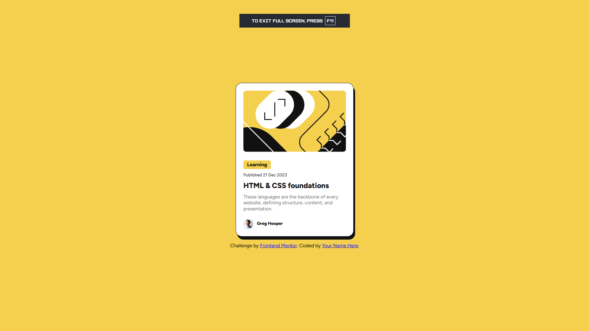

# Frontend Mentor - Blog preview card solution

This is a solution to the [Blog preview card challenge on Frontend Mentor](https://www.frontendmentor.io/challenges/blog-preview-card-ckPaj01IcS). Frontend Mentor challenges help you improve your coding skills by building realistic projects.

## Table of contents

- [Overview](#overview)
  - [The challenge](#the-challenge)
  - [Screenshot](#screenshot)
  - [Links](#links)
- [My process](#my-process)
  - [Built with](#built-with)
  - [What I learned](#what-i-learned)
- [Author](#author)

## Overview

### The challenge

Users should be able to:

- See hover and focus states for all interactive elements on the page

### Screenshot



### Links

- Solution URL: [https://github.com/ichanmsngkyy/FrontendMentor-Projects/tree/main/blog_preview]
- Live Site URL: [https://ichanmsngkyy.github.io/FrontendMentor-Projects/blog_preview]

## My process

I fix the layout first before creating the css file.

### Built with

- Semantic HTML5 markup
- CSS custom properties
- Flexbox
- CSS Grid

### What I learned

How to utilize flexbox for designing simple layouts

```html
<h1>Some HTML code I'm proud of</h1>
```

```css
.proud-of-this-css {
  color: papayawhip;
}
```

```js
const proudOfThisFunc = () => {
  console.log("🎉");
};
```

## Author

- Github - [ichanmsngkyy](https://github.com/ichanmsngkyy)
- Frontend Mentor - [@ichanmsngkyy](https://www.frontendmentor.io/profile/ichanmsngkyy)
